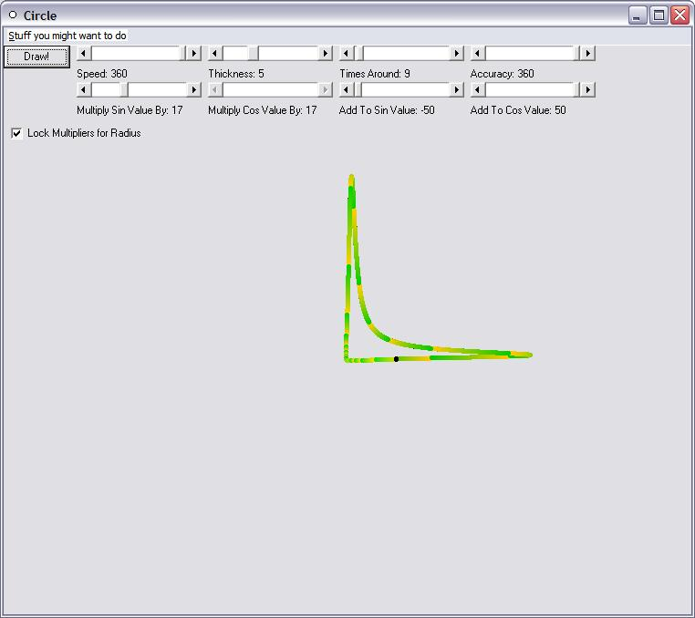



## Salvador Dali Circle

### Description

Yet another great graphical program from the creators of the Venus project! Ever seen that Salvador Dali painting with the droopy clocks? Well, I have! This is nothing like that. See the screenshot. You can draw regular circles, or you can change just about anything in it, so it could be a circle stuffed up in a corner, or hanging over a table, or anything you want!
 
### More Info
 

             |
---                |---
**Submitted On**   |2002-03-16 10:49:20
**By**             |[Edward Dassmesser](https://github.com/Planet-Source-Code/PSCIndex/blob/master/ByAuthor/edward-dassmesser.md)
**Level**          |Beginner
**User Rating**    |5.0 (15 globes from 3 users)
**Compatibility**  |VB 5\.0, VB 6\.0
**Category**       |[Graphics](https://github.com/Planet-Source-Code/PSCIndex/blob/master/ByCategory/graphics__1-46.md)
**World**          |[Visual Basic](https://github.com/Planet-Source-Code/PSCIndex/blob/master/ByWorld/visual-basic.md)
**Archive File**   |[Salvador\_D626873162002\.zip](https://github.com/Planet-Source-Code/edward-dassmesser-salvador-dali-circle__1-32725/archive/master.zip)

